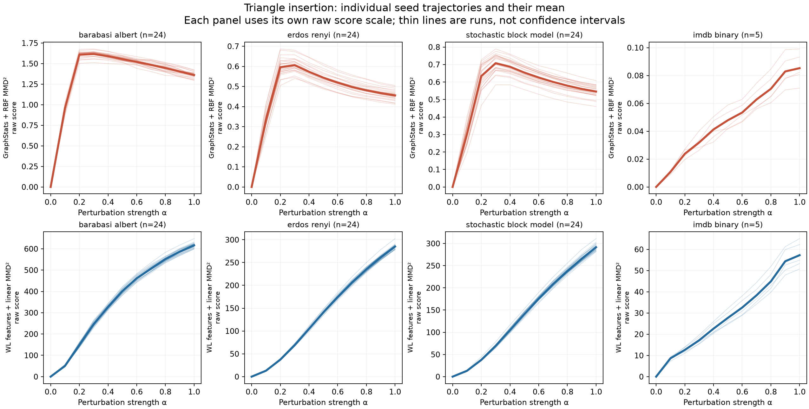
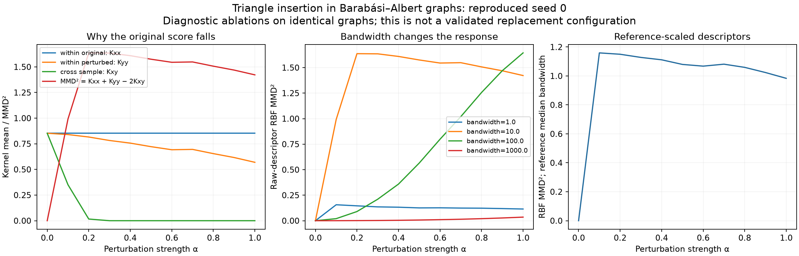

# Statistical audit and response diagnostics

The current results support analysis of **distribution-score trajectories across seeds**. They do not yet support the thesis's proposed tests on individual graph distances. A blanket choice of t-test or Wilcoxon is inappropriate: the unit of replication, contrast and response shape must be specified first.

This audit reads the 20,328 successful rows from `2026-07-03_merged`. It leaves the historical experiments and thesis unchanged. Source hash, software versions and test definitions are recorded in `analysis_manifest.json`. The dataset contains 96 settings: 4 workflows × 4 datasets × 6 perturbations. Each setting has 11 alpha levels, 100 graphs per distribution, and either 24 seeds (synthetic) or 5 seeds (IMDB-BINARY).

## 1. What can be tested now?

For a fixed dataset, perturbation and workflow, write the stored score as S(seed, alpha). The experimental observation for inference is a **whole seed trajectory**, not each CSV row, and not each of the 100 graphs used to calculate that row.

The same source graphs and perturbation random stream are reused at successive alpha levels. Workflows also evaluate the same graph samples. Their measurements are therefore paired. Pooling all rows into an ordinary correlation test or independent-samples t-test would inflate the apparent sample size. The existing evaluation computes a pooled Spearman coefficient descriptively; it does not supply a dependence-aware significance test.

There is a further independence concern: `generate_paired_distribution()` uses `seed + graph_index` as the perturbation seed. For example, run seed 0 / graph 1 and run seed 1 / graph 0 both use random seed 1. With 100 graphs and run seeds 0–23, runs share many perturbation streams. Different base graphs do not remove this shared source of randomness. The amount of induced dependence is unknown; the audit does **not** establish that it is negligible.

Consequently, all reported sign-test p-values are explicitly **conditional on independent seed trajectories and exploratory**. They are useful for designing the final analysis, but should not be presented as calibrated confirmatory evidence from these legacy runs. Multiple-testing correction does not repair dependence between the observations of a test.

For a new validation run, derive distinct random streams from a master seed plus dataset, run seed, graph ID, perturbation and purpose. Keep the stream shared across alpha only when deliberately constructing paired/nested trajectories, and across workflows to retain fair pairing. Separate dataset-generation and perturbation streams. Preserve this historical run and identify the new run separately.

IMDB inference also needs a target: repeated subsamples of this fixed dataset assess reproducibility conditional on that dataset; they do not establish generalization to new datasets or populations. Overlapping sampled graphs must be considered for population-level inference.

## 2. Do t-test or Wilcoxon assumptions fit?

Define a contrast first, for example D(seed) = S(seed, 1.0) − S(seed, 0.1). Analyze the distribution of these differences **within one setting**, rather than testing the normality of all scores combined.

| Method | Question | Conditions and current verdict |
| --- | --- | --- |
| Paired t-test | Is the mean contrast zero? | Requires independent pairs and, for exact small-sample inference, normal differences. Inspect Q–Q plots, skewness and influential observations. Some synthetic contrasts look compatible; there is no global approval for all settings. The random-stream issue remains. |
| Wilcoxon signed-rank | Is the difference distribution symmetric about zero? | Requires independent differences and a symmetry assumption; it is not a general substitute whenever normality is rejected. Ties and zeros affect the reference distribution. Symmetry is not established across these settings. |
| Exact sign test | Are positive and negative nonzero contrasts equally likely? | Does not require normality or symmetry. Discards magnitude, so report effect sizes alongside it. Still requires independent replicate signs. Used here provisionally. |
| Repeated-measures model | How does the mean score depend on alpha, including nonlinear response? | Use seed clustering and a categorical-alpha or suitably flexible curve; check residuals, variance and covariance assumptions. A simple random intercept alone may not capture within-trajectory dependence. Requires an adequate number of independent seeds. |

For D = S(1.0) − S(0.1), 9 of 72 synthetic settings have Shapiro–Wilk p < .05. Across the 720 synthetic adjacent-alpha contrasts, 76 are numerically constant; 79 of the remaining 644 have Shapiro p < .05. Across the 240 IMDB adjacent contrasts, 12 are constant and 14 of the remaining 228 have Shapiro p < .05. These are **uncorrected diagnostic flags**, not counts of proven non-normal populations. A non-rejection is not evidence that normality or symmetry has been established. With five seeds, such checks have especially limited power.

Do not select t-test versus Wilcoxon mechanically using a Shapiro p-value. Pick the estimand and analysis in advance; use diagnostics and sensitivity analyses to assess it. Constant contrasts should be reported directly, rather than forcing a test whose variance estimate is zero.

The thesis's graph-level distances p(i, alpha) are absent from the result table. `paired_score` is their mean. These means cannot reconstruct their distribution or the graph-level paired tests proposed in sections 4.8.3 and 4.8.8. Recovering that analysis requires regenerating and saving graph IDs and individual representations/distances, with graph and seed clustering accounted for. Those tests answer an individual-distance question, not directly a distribution-score question.

Method references: [NIST paired observations](https://www.itl.nist.gov/div898/handbook/prc/section3/prc311.htm), [SciPy Wilcoxon](https://docs.scipy.org/doc/scipy/reference/generated/scipy.stats.wilcoxon.html), [SciPy exact binomial test](https://docs.scipy.org/doc/scipy/reference/generated/scipy.stats.binomtest.html).

## 3. Tests run and what they mean

The audit computes Spearman correlation separately for each seed using alpha = 0.1,…,1.0. It also retains the all-alpha coefficient. Excluding alpha zero is a sensitivity analysis: all workflows compare a sample to its identical copy at zero and return exactly zero. That point is useful as an implementation check but can create apparent dose ordering even when all positive-alpha scores plateau.

Two families of two-sided exact sign tests were run:

1. Signs of within-seed Spearman correlations over positive alpha: a test of directional consistency across trajectories, **not a general test of statistical independence between alpha and score**.
2. Signs of S(1.0) − S(0.1): a broad endpoint contrast, **not a test of monotonicity throughout the interval**.

Each family contains 96 settings and receives its own Holm adjustment. Holm was chosen to accommodate dependence among setting-level tests, assuming each underlying p-value is valid. Numerical zeros are omitted from the sign count and reported separately; constant trajectories have undefined correlation, not correlation zero. Adjacent contrasts receive shape diagnostics only, without uncorrected significance claims. Choices were made after seeing existing results, so this is an exploratory analysis rather than a preregistered validation.

For triangle insertion:

| Dataset | GraphStats median seed rho, alpha > 0 | GraphStats negative / total | WL median seed rho, alpha > 0 | WL positive / total |
| --- | ---: | ---: | ---: | ---: |
| Barabási–Albert | −0.442 | 24/24 | 1.000 | 24/24 |
| Erdős–Rényi | −0.442 | 24/24 | 1.000 | 24/24 |
| Stochastic Block Model | −0.382 | 24/24 | 1.000 | 24/24 |
| IMDB-BINARY | 1.000 | 0/5 | 1.000 | 5/5 |

For 24 agreeing signs, the conditional two-sided p-value is 1.1921e−7; the Holm-adjusted value in this trend family is 1.1444e−5. **These values require independent seeds, which the current seed assignment does not guarantee.** For 5 agreeing signs, even an unadjusted two-sided sign test gives p = .0625. A clean-looking five-seed plot cannot support a .05 rejection with this test. Do not choose a one-sided test after observing its direction just to cross a threshold.

GraphStats nevertheless has S(1.0) > S(0.1) in every synthetic seed for triangle insertion. The mean differences are +0.402 (BA), +0.121 (ER) and +0.244 (SBM). This is compatible with a negative rank trend: the score rises sharply early and then declines over most of the grid. Neither a single endpoint test nor near-zero pooled correlation describes that nonlinear relationship adequately.



## 4. Why GraphStats and WL behave differently

The implemented workflow is **WL subtree features + linear MMD**, not Wasserstein–Weisfeiler–Lehman. GraphStats uses nine unstandardized descriptors and an RBF bandwidth of 10 in all four datasets. Both stored MMD scores are squared MMD quantities.

GraphStats's RBF MMD² is bounded between 0 and 2; it cannot numerically diverge to infinity under this implementation. Its maximum in the run is 1.871. WL's linear MMD² has a different scale and reaches 10,739.378. Raw magnitudes do not rank the workflows' quality. The important GraphStats anomaly here is an early rise followed by a decline.

The GraphStats mean triangle-insertion score peaks at alpha .3 in each synthetic dataset, then falls to the alpha-1 endpoint:

| Dataset | Peak mean | Endpoint mean | Decline from peak |
| --- | ---: | ---: | ---: |
| BA | 1.617 | 1.361 | 15.8% |
| ER | 0.606 | 0.456 | 24.8% |
| SBM | 0.708 | 0.546 | 22.9% |

I regenerated all 11 triangle-insertion alpha levels for seed 0 in all four datasets. The 44 GraphStats scores match the historical scores to a maximum absolute error of 2.22e−16. This validates the diagnostic against the logged calculation, rather than merely proposing a mechanism from a plot.

Write MMD² = Kxx + Kyy − 2Kxy, where these are average RBF similarities within the original sample, within the perturbed sample, and across the two samples. On BA seed 0:

| Quantity | alpha .3 | alpha 1.0 |
| --- | ---: | ---: |
| Kxx | 0.8528 | 0.8528 |
| Kyy | 0.7823 | 0.5695 |
| Kxy | 0.0000701 | approximately 0 |
| MMD² | 1.6349 | 1.4223 |
| Mean paired descriptor L2 distance | 47.33 | 188.12 |

Once cross-sample similarity is almost zero, it cannot decrease much further. The perturbed sample's internal similarity continues to fall, so MMD² falls too. The paired descriptor distance still grows strongly. Thus the decline is a property of this kernel response along this perturbation path, not evidence that the perturbation stopped or that the descriptors registered no change. RBF MMD need not be monotone in edit count or nominal alpha. Characteristic-kernel distinguishability does not imply such monotonicity; see [Gretton et al., A Kernel Two-Sample Test](https://www.jmlr.org/papers/volume13/gretton12a/gretton12a.pdf).

At BA alpha 1, triangle count accounts for 73.1% and edge count for 26.5% of average squared cross-sample descriptor distance. These two unscaled count features therefore dominate the RBF geometry in this diagnostic. This is a geometric decomposition, not an estimate of causal feature importance.

On the same BA seed and graphs, increasing raw bandwidth to 100 changes the score from 0.210 at alpha .3 to 1.644 at alpha 1.0. Reference-only feature standardization plus reference median bandwidth still gives a declining segment (1.128 to 0.984). Bandwidth matters, but standardization is not an automatic cure. These are one-seed ablations per dataset; a final configuration requires independent validation, not choosing the bandwidth with the most attractive curve.

IMDB's seed-zero Kxy remains appreciable at alpha .3 and continues decreasing toward alpha 1, explaining its different balance of terms. This does not establish that all real datasets behave differently from all synthetic datasets: graph size, distribution heterogeneity and kernel scale are confounded in this comparison.



## 5. Additional findings and thesis corrections

**Three workflows do not supply an additional distribution signal beyond their mean-representation shift.** NetLSD and Diversity curves have `distribution_score == mean_shift_score` exactly in these rows. WL has `distribution_score == mean_shift_score²` to floating-point precision (maximum absolute error 5.46e−12). WL's linear kernel therefore compares mean WL feature counts; it does not independently detect all higher-moment changes in those feature vectors. The broad MMD statement in thesis section 4.8.2, printed page 55, needs this qualification. Nonlinear graph features and a nonlinear kernel on graph-feature distributions are distinct concepts.

**Hub plateaus need an operator diagnostic.** Logged mean raw edit counts become identical to their endpoint in every recorded seed from alpha .4 (ER), .5 (SBM), .8 (BA), and .7 (IMDB). Earlier figure notes used approximate score plateaus (.4/.6); those are not exact edit-budget exhaustion points. A flat score while realized edits are flat provides no evidence that the method is blind to additional changes. Conversely, equal edit counts alone do not prove the final graphs are identical; graph hashes would strengthen that check.

**Low correlation is not absence of a relationship.** The synthetic GraphStats triangle curves are reproducibly nonlinear. Low CV does not establish correctness, and positive correlation does not establish early detection. Neither property replaces a calibrated null comparison.

**Community claims require controlled comparisons.** ER has no planted communities, but detected partitions and degree heterogeneity still exist in finite samples. Rewiring against those partitions can change measurable structure. The current cross-dataset results cannot isolate the effect of planted versus detected labels. Such a claim needs both label strategies on the same graphs and matched realized edit budgets. Existing narrative claims attributing all differences to community labels or calling ER a strict null should be softened.

**A zero self-comparison is not an empirical null distribution.** To claim a detection threshold, generate independent unperturbed reference samples or another scientifically justified null consistent with the paired design. A standard unpaired MMD permutation test cannot simply be attached to these paired samples; any resampling scheme must justify its exchangeability assumptions. Monotonicity tests and two-sample detection tests answer different questions.

## 6. Recommended next validation

1. State the primary estimand: reproducible positive dose response of the distribution score within a fixed dataset/perturbation/workflow. Also assess nonlinear response, so a peaked curve is not mislabeled as no relationship.
2. Run independent seed trajectories using distinct random streams; retain graph IDs, realized edits and per-graph representations/distances. Use more than five seeds for the real-data condition, with sample size planned around a scientifically meaningful effect and desired precision.
3. Use whole-trajectory resampling for uncertainty after independence is secured. Use paired seed contrasts or a repeated-measures model for alpha effects; predefine the contrasts and correction family. A sign test is a conservative option when symmetry is not plausible, while a paired t-test or Wilcoxon can be a justified sensitivity analysis for appropriate contrasts.
4. Validate GraphStats scaling and bandwidth on separate runs; retain RBF term diagnostics. Report response shapes, seed variation and realized edit dose together. Do not interpret raw cross-workflow score differences as superiority.
5. Use the saved individual distances for the thesis's separate graph-level analysis, respecting graph-within-seed dependence and the fact that representations may themselves be jointly computed.

The existing analysis is inexpensive: it reuses a 20,328-row table, and the mechanism diagnostic regenerates only 44 selected cells without running the costly spectral/diversity workflows. The main remaining effort is experimental design and a properly replicated validation run, not the arithmetic of a t-test or Wilcoxon test.

## Reproduction and outputs

Install the optional analysis dependencies with `pip install -e '.[analysis]'`, then run from the repository root:

```sh
python scripts/analyze_statistical_assumptions.py
python scripts/diagnose_mmd_response.py
python -m unittest discover -s tests -p test_statistical_audit.py -v
```

`trajectory_summary.json` and `seed_trajectories.json` preserve setting and seed results. `paired_difference_diagnostics.json` contains 1,056 contrast diagnostics. `mmd_kernel_diagnostics.json` contains the reproduced kernel terms, feature contributions and bandwidth ablations. `structural_checks.json` records score identities, ranges and edit plateaus. `paired_difference_diagnostics.png` shows representative difference and normal Q–Q plots. The three focused tests cover exact small-sample p-value resolution, zero/tie handling, Holm adjustment and rejection of incomplete alpha trajectories.
