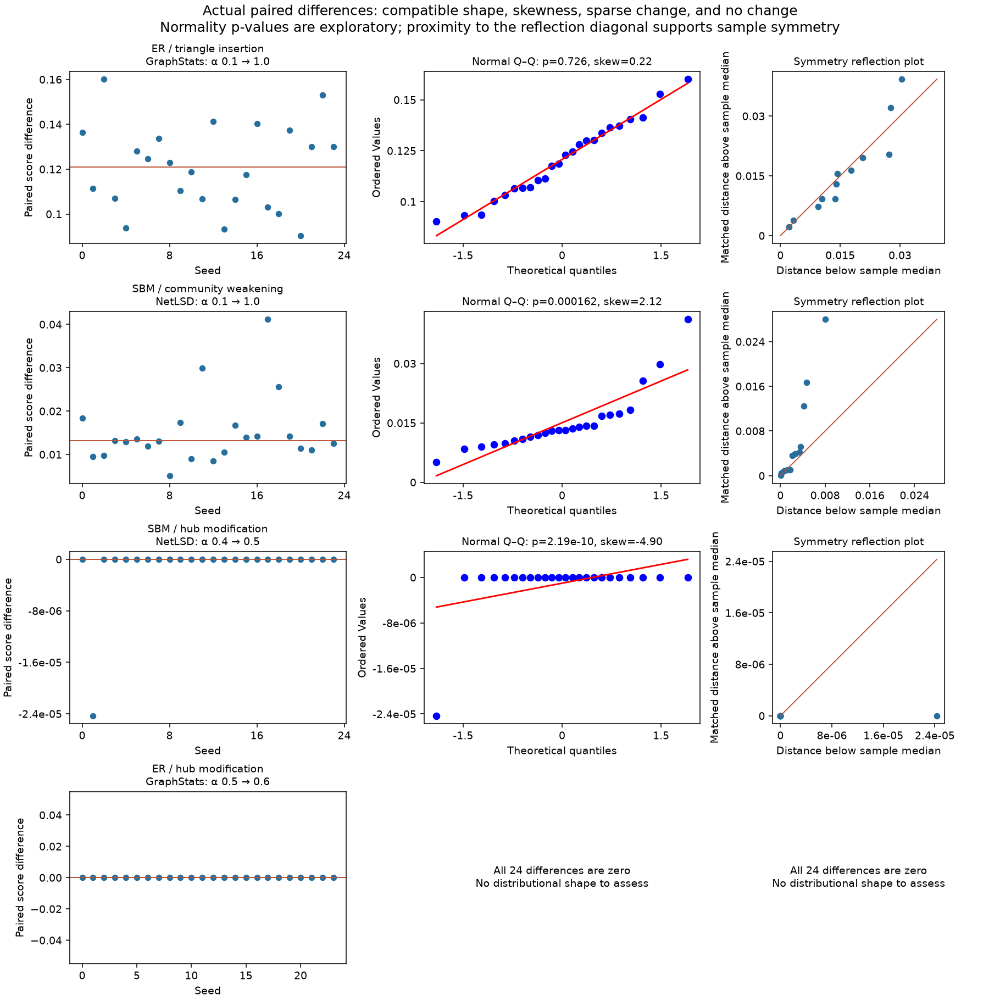

# Distributional conditions checked on the actual synthetic results

**Conclusion:** distributional assumptions are plausible for some paired contrasts and poorly supported for others. Neither a paired t-test nor Wilcoxon signed-rank should be applied indiscriminately throughout the experiment grid. The clearest problems are skewed tails, sparse nonzero differences and completely flat increments. This is an assessment of data shape; it does not authorize confirmatory inference from the legacy seed design.

This audit excludes IMDB-BINARY. It analyzes the 19,008 synthetic result rows in the current merged run: 3 datasets × 6 perturbations × 4 workflows × 11 alpha levels × 24 seeds. ZINC is not present in that result file, so no claims about its distributional conditions are made.

## What was inspected

For each dataset / perturbation / workflow setting, the data for a two-level test is the vector of 24 differences:

`D(seed) = distribution_score(seed, alpha_high) - distribution_score(seed, alpha_low)`.

The relevant normality or symmetry is the shape of this difference vector, not the combined distribution of all scores and not the graph features themselves. Different alpha intervals produce different difference distributions even within the same setting. Equal variances of the two original score samples are not required for a paired t-test.

I checked one broad contrast (alpha .1 to 1.0) per setting and all ten adjacent contrasts, including 0 to .1. This gives 72 broad contrasts and 720 adjacent contrasts. The zero baseline is included here to audit the entire grid, not as a recommended basis for a detection claim.

The diagnostics are Shapiro–Wilk, sample skewness and excess kurtosis, normal Q–Q correlation, central and tail quantile asymmetry, Tukey outlier flags, zeros, approximate ties in absolute nonzero differences, and zero variance. Four contrasting examples were also reviewed visually with seed plots, normal Q–Q plots and symmetry reflection plots.

Shapiro p-values are unadjusted exploratory diagnostics. The summary screen flags `p < .05` or `|sample skewness| > 1` for closer review. The skewness threshold is a descriptive convention, not a statistical rejection threshold. A screen flag does not prove that a t-test would give a wrong answer; absence of a flag does not prove normality or symmetry. Tests should not be selected mechanically from these labels. Independence of observations also underlies the reference distribution of Shapiro itself, so its p-values inherit the seed-design qualification.

Numerical zero/constant checks use tolerance `1e-12 * max(1, largest absolute score in the two matched samples)`. Raw differences are retained, and their recorded tolerance is available for inspection; this is not a substantive minimum-effect threshold.

## Results across the grid

| Diagnostic | Broad .1-to-1.0 contrasts | Adjacent contrasts |
| --- | ---: | ---: |
| Contrasts examined | 72 | 720 |
| All 24 differences are numerically zero | 0 | 76 |
| Nonconstant contrasts examined for normality | 72 | 644 |
| Shapiro p < .05, unadjusted | 9 | 79 |
| Absolute sample skewness > 1 | 11 | 69 |
| Flagged by either of the preceding two screens | 11 | 87 |
| Nonconstant, without either screen flag | 61 | 557 |
| Nonconstant, with one or more zero differences | 0 | 24 |
| Only 1–5 nonzero differences out of 24 | 0 | 20 |

These rows overlap and should not be summed. In particular, the 20 sparse contrasts are included among the nonconstant contrasts. The 61 broad contrasts without a screen flag are candidates for further judgment, not 61 certified normal populations.

## Four concrete decisions from the data

### ER / triangle insertion / GraphStats, alpha .1 to 1.0

The paired differences have mean 0.12072 and median 0.12085. Sample skewness is 0.216, Shapiro p is .726, the normal Q–Q correlation is .991, and there are no Tukey outlier flags or zero differences. Bowley asymmetry is −0.019, very close to zero. The Q–Q plot is fairly straight; the reflection plot shows some tail variation but no pronounced one-sided tail.

**Shape verdict:** approximately normal differences are a reasonable working model for this specific contrast. A paired t-test is a defensible candidate if the goal is the mean difference, conditional on resolving the separate independence issue. Approximate symmetry is also plausible here, so Wilcoxon could be a sensitivity analysis. A high Shapiro p alone was not used to make this judgment. This verdict does not automatically apply to other alpha intervals or workflows.

### SBM / community weakening / NetLSD, alpha .1 to 1.0

The mean difference is 0.01504, versus median 0.01316. Sample skewness is 2.125, excess kurtosis is 5.386 and Shapiro p is .000162. The Q–Q correlation is .873, with a marked upper-tail departure. Two values are beyond the Tukey upper fence; they are retained as observations, not removed as errors. Tail quantile asymmetry is 0.440, and the reflection plot shows that the upper tail extends much farther than the lower tail.

**Shape verdict:** normality is poorly supported, and symmetry is also questionable. I would not use either paired t-test or Wilcoxon as the sole primary basis for this contrast. If the scientific target is the probability of a positive difference, an exact sign test avoids these shape assumptions. If the mean is the target, a mean-focused robust/resampling analysis requires separate assessment; switching to a sign test changes the question.

### SBM / hub modification / NetLSD, alpha .4 to .5

There are **23 zero differences and one negative difference**, approximately −0.0000243. The mean is approximately −0.00000101. This is a spike at zero with a single nonzero observation, not an approximately normal or convincingly symmetric distribution of differences. Skewness is −4.899. The interquartile range is zero, so central quantile asymmetry is undefined rather than zero.

**Shape verdict:** t-test assumptions are poorly supported; default continuous signed-rank inference is unsuitable without handling zeros/ties, and only one nonzero pair remains under the usual zero-discarding convention. A conditional exact sign test has n=1 and two-sided p=1 regardless of the sign. The informative report is the observed change frequency (1/24), magnitude and operator behavior. A different test cannot manufacture replication of a change that occurred only once.

### ER / hub modification / GraphStats, alpha .5 to .6

All 24 paired differences are zero, with mean and standard deviation zero.

**Shape verdict:** no normality assessment or ordinary t-statistic is meaningful here. Report no observed score change in these repetitions and inspect whether the perturbation itself has saturated. Do not claim population equivalence or proof of no effect from this finite-sample observation. The default asymptotic Wilcoxon calculation can also be undefined when all differences are zero.

## What this means for the proposed tests

**Paired t-test:** plausible for well-behaved differences such as the ER triangle-insertion example. Strong skewness, heavy tails or a spike at zero make the normal approximation less defensible with 24 observations. Non-normality alone does not establish that the t-test is useless; robustness depends on the degree and form of departure. These diagnostics identify where it needs more justification.

**Wilcoxon signed-rank:** dropping normality does not remove the symmetry assumption. Symmetry is assessed about an unknown location, estimated here by the sample median. Requiring the observed differences to be symmetric about zero would incorrectly mix an assumption check with testing the effect itself. The audit uses central and tail quantile balance and reflection plots; neither zero sample skewness nor a non-significant normality test proves symmetry. Ties and zeros require a suitable reference distribution and affect the amount of information available. The pronounced skewed and sparse examples above do not support Wilcoxon as a blanket fallback.

**Exact sign test:** does not need normality or symmetry. It is a reasonable candidate when the target is directional consistency and there are enough independent nonzero differences. With 1–5 nonzero pairs, the smallest possible two-sided p-value is at least .0625, even before multiple-testing correction. It tests sign balance conditional on a nonzero difference, so report the zero fraction too. It does not test equality of mean scores.

**Spearman correlation:** does not require normal score distributions. It summarizes monotonic association, however, so the observed peaked GraphStats curves can have low or negative correlation while still depending strongly on alpha. Within-seed ties and plateaus also limit rank resolution. Use the trajectory shape alongside rho; a usual pooled correlation p-value does not account for repeated measurements.

**Friedman or a repeated-measures model:** the difference-shape checks here do not certify either method. Friedman does not require normality, but independent blocks and a defensible null for repeated ranks remain necessary. Observed skewness alone is not a reason to reject Friedman. A repeated-measures model requires its own residual and covariance diagnostics after the model and estimand are specified. Neither method has been approved based on the current normality screen.

The observed conditions therefore favor a planned, question-specific analysis over running the same test in every cell or choosing whichever test produces significance. These diagnostics do not resolve the separate reuse of perturbation random streams across seeds. Shape compatibility and independence must both be defensible before a confirmatory result is claimed.

## Full results and reproduction

- [All 72 settings](setting_summary.md): broad-contrast diagnostics and counts of problematic adjacent intervals.
- `contrast_diagnostics.json`: all 792 contrasts, actual differences, matched seeds and full numerical diagnostics.
- `setting_summary.json`: the setting-level summary in machine-readable form.
- `reviewed_examples.json`: the four examples discussed above.
- `manifest.json`: source checksum, scope, software versions, thresholds and summary counts.

Run `python scripts/check_distributional_conditions.py` from the repository root with the existing optional analysis dependencies installed. Verification covers zero and sparse differences, symmetry about a nonzero location, and invariance of shape diagnostics to the score's units. The historical run and previous audit are preserved.

## Method references

- [NIST: Normal probability plots](https://www.itl.nist.gov/div898/handbook/eda/section3/normprpl.htm) explains how tail departures and skewness appear in Q–Q plots.
- [SciPy: Shapiro–Wilk](https://docs.scipy.org/doc/scipy/reference/generated/scipy.stats.shapiro.html) documents the normality test used for the diagnostic p-values.
- [SciPy: Wilcoxon signed-rank](https://docs.scipy.org/doc/scipy/reference/generated/scipy.stats.wilcoxon.html) documents the symmetric-difference null and the treatment of ties and zeros.
