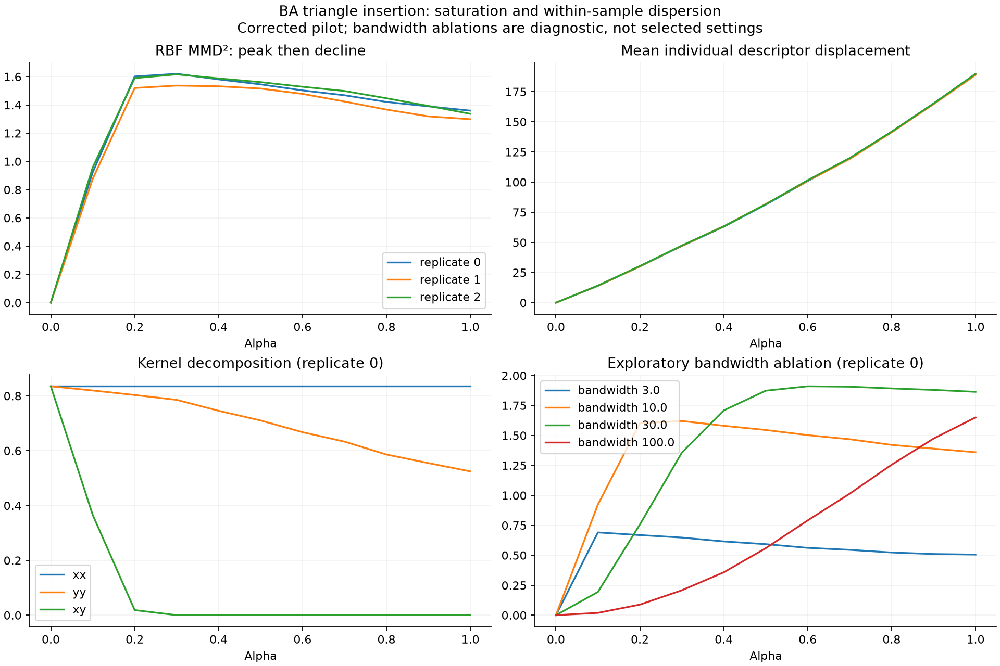
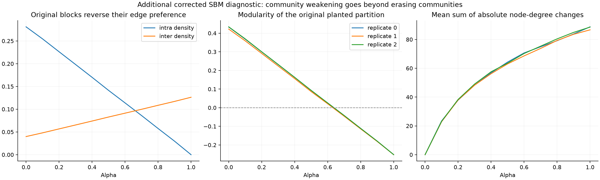
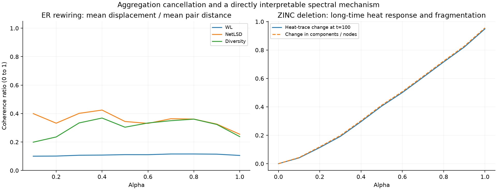

# Structural mechanisms behind the experiment results

Date: 2026-09-16. This is an exploratory scientific analysis, not a significance-testing report.

The most useful conclusion is that **a response curve belongs to the combination of generator, perturbation, representation, and aggregation rule**. A method-family label alone does not explain it. The current experiments already expose several mechanisms that a mean score versus alpha hides: kernel saturation, degree-dominated WL responses, cancellation during averaging, changes of structural regime, and exhausted perturbation opportunities.

This report follows the thesis's actual objective: characterize response profiles and explain discordant cases, rather than identify a universally best metric. Relevant thesis passages are the research questions and hypotheses on printed pages 7–9, the measurement definitions on pages 54–59, and the case-analysis criteria on pages 60–61. [Thesis](../../../docs/tesis.pdf). The PDF still names IMDB-BINARY; the user's updated scope replaces it with ZINC.

## 1. Evidence and its limits

The main evidence is the corrected 1,056-row pilot: three replicate distributions of 100 graphs, eleven alpha levels, all four workflows, for BA triangle insertion, ER community weakening, and all six ZINC perturbations. The 26,400 graph-pair records include repeated observations of the same source graphs across alpha. They are not 26,400 independent replicates.

Additional diagnostics reconstruct the saved scores, decompose their mechanisms, and probe the missing synthetic comparisons using the same pilot stream protocol. The **198 additional cells** cover synthetic hub modification, SBM community weakening, and matched-budget BA edge/triangle insertion. They do not constitute a full four-workflow production rerun. Three independent unperturbed reference comparisons per synthetic family illustrate sampling effects; they are too few to calibrate detection thresholds.

The 19,008 historical synthetic rows are retained in a separate [descriptive summary](historical_descriptive_summary.json). Their perturbation streams overlap, and historical NetLSD used the old eigensolver. They supply exploratory context, not independent confirmation. No IMDB rows enter this report. No experiment inputs, metric definitions, or original result files were changed.

Every statement below is identified as an observed result, an exact implementation/algebraic consequence, or a proposed interpretation requiring further controls. Three corrected replicates can establish what happened in these runs and support mechanism checks; they do not establish population-wide rankings.

## 2. What the graph families actually control

| Family | Actual configuration | Structural expectation | Consequence for interpretation |
|---|---|---|---|
| ER | 50 nodes; independent edge probability 0.12 | Expected edges 147; mean degree 5.88; expected triangles 33.87 | A homogeneous generator still produces finite-sample degree variation, triangles, and partitions with positive optimized modularity. |
| SBM | 50 nodes in blocks 13/13/12/12; within probability 0.28, between 0.04 | Expected edges 118.12; mean degree 4.7248; planted assortative blocks | Community experiments have a known reference partition, but this setting is also sparser than ER. |
| BA | 50 nodes; attachment parameter 2; initial three-node clique | Exactly 97 edges; mean degree 3.88; heterogeneous degrees from preferential attachment | Edge count has no between-graph variation; degree/triangle heterogeneity can dominate other descriptors. At 50 nodes, do not claim an empirically established power-law tail. |
| ZINC pilot | 100 validation records per replicate, varying graph size; topology only | Sparse, initially connected graphs; very few triangles | Fragmentation and perturbation feasibility become central; results concern topology, not chemical validity. |

ER and SBM expectations above are calculated directly from this repository's Bernoulli generators; BA's edge count follows from its initialization and growth loop. These are not estimates from a fitted model. The synthetic families are **controlled mechanisms, not perfectly isolated properties**: density, degree distribution, clustering, and path structure differ simultaneously.

The multiscale comparison literature supports using graph ensembles to formulate structural hypotheses while distinguishing fine, intermediate, and large-scale effects. It does not justify transferring a ranking across different graph ensembles without checking the changed conditions. [Wills and Meyer, 2020](https://journals.plos.org/plosone/article?id=10.1371/journal.pone.0228728). Growth and preferential attachment are the mechanisms motivating BA; the finite generator implemented here is the operative definition. [Barabási and Albert, 1999](https://barabasi.com/media/Emergence-Barabasi-1999_gN74Tws.pdf).

## 3. What each implemented workflow can measure

Let `phi(G)` be a graph representation, `Delta_i = phi(G_i^alpha) - phi(G_i)`, and `P = mean_i ||Delta_i||` the saved paired score.

| Workflow | Representation in this repository | Saved distribution score | Expectation and restriction |
|---|---|---|---|
| GraphStats + RBF MMD² | Nine raw descriptors: nodes, edges, density, mean degree, degree variance, clustering, triangles, transitivity, components | `Kxx + Kyy - 2 Kxy`, Gaussian bandwidth 10 | Can respond to distributional differences in these descriptors; cannot recover structure discarded by them. Scaling and bandwidth determine the geometry. |
| WL features + linear MMD² | Degree labels, then three refinement rounds; concatenated count histograms | `||mean Delta_i||²` | Sensitive to degree/neighborhood count changes, but exact-label matching can become sparse; not a general triangle counter. This is WL, not Wasserstein-WL. |
| NetLSD | 250 normalized-Laplacian heat-trace samples, times 0.01–100, divided by node count | `||mean Delta_i||` | Spectral response across diffusion times; loses eigenvector information and can average away opposing changes. |
| Diversity Curves | Shortest-path spread across cardinalities; three random contraction repetitions; upsampling where needed | `||mean Delta_i||` | Response to distance geometry across coarsenings; finite coarsening variation and averaging both affect the result. |

The WL paper motivates iterative neighborhood-label histograms and their inner-product kernel; it does not imply that every motif change will be distinguishable. [Shervashidze et al., 2011](https://jmlr.org/papers/volume12/shervashidze11a/shervashidze11a.pdf). NetLSD motivates comparing spectral signatures at multiple diffusion times. [Tsitsulin et al., 2018](https://arxiv.org/pdf/1805.10712). Diversity Curves measures spread over coarsening levels; its theoretical expressivity results involving all contraction sequences should not be identified with a three-repeat numerical approximation. [Limbeck et al., 2026, sections 3 and A.1](https://arxiv.org/html/2605.06466v1).

**An important thesis correction:** section 4.8.2 says that the MMD workflows incorporate higher-order distributional information through their kernels. That qualification applies to the Gaussian-kernel descriptor comparison, but not to the implemented linear-WL aggregation: its score is exactly the squared displacement of the mean WL feature vector. A nonlinear graph representation does not turn a linear distribution kernel into a characteristic kernel. Kernel assumptions matter to MMD's distinguishability guarantees. [Gretton et al., 2012, section 2](https://www.jmlr.org/papers/volume13/gretton12a/gretton12a.pdf).

Consequently, raw score sizes cannot rank the four methods: two scores are squared, two are not; coordinates, units, and dimensions differ. The same warning applies to interpreting a larger paired distance as stronger evidence across different representations.

## 4. BA triangle insertion: GraphStats sees increasing change while its MMD score falls

**Observed and numerically reconstructed.** Across the three corrected BA replicates:

| Quantity, replicate mean | Alpha 0.3 | Alpha 1.0 |
|---|---:|---:|
| GraphStats RBF MMD² | 1.59121 | 1.33172 |
| Original within-sample similarity, Kxx | 0.82476 | 0.82476 |
| Perturbed within-sample similarity, Kyy | 0.76664 | 0.50696 |
| Cross-sample similarity, Kxy | 0.000093 | approximately 0 |
| Mean individual descriptor L2 change | 47.21 | 189.42 |

Once Kxy is almost zero, further separation cannot reduce it appreciably. Kyy continues falling as perturbed descriptors become less mutually similar. The saved MMD² therefore falls, even while individual displacement grows fourfold. This is a decomposition of the actual score, not a guessed explanation based on the shape of a curve.

At alpha 1, triangles account for about **73.5%** and edge count **26.1%** of mean squared cross-sample descriptor distance. These are geometric shares, not causal feature importance. The raw triangle and edge counts dominate the Gaussian geometry; a clustering change on a 0–1 scale has much less weight. The fixed BA edge count also helps make the original descriptor sample relatively concentrated.

The same saved descriptors were recomputed at bandwidths 3, 10, 30, and 100. The shape changes with bandwidth. These diagnostic alternatives are not replacement settings chosen to make curves look monotone. GraphStats is not “exploding”: its implemented unit-amplitude Gaussian MMD² is bounded by 2. The important phenomenon is rapid separation followed by loss of ordering along this perturbation path.

This is consistent with literature showing that graph-MMD behavior and model rankings can depend strongly on descriptors, kernels, and their parameters; monotonic growth is not guaranteed. [O'Bray et al., 2022, section 4](https://arxiv.org/pdf/2106.01098). Our additional contribution here is identifying the particular kernel terms and descriptor coordinates responsible in these runs.

**Implication:** a falling score is not evidence that triangles stopped changing or that the representation ignored the perturbation. Report descriptor displacement and the three kernel terms beside MMD. If alpha-ordering is a goal, validate scaling/bandwidth on separate development data and retain the original baseline as a labeled configuration.



## 5. The smooth WL curve is mostly a degree response, and conceals individual reversals

**Observed through an exact decomposition by refinement level.** At the BA triangle-insertion endpoint, mean WL MMD² decomposes as:

| Histogram block | Contribution |
|---|---:|
| Initial degree labels, h=0 | 609.8523 |
| First neighborhood refinement, h=1 | 7.5468 |
| Second refinement, h=2 | 1.0450 |
| Third refinement, h=3 | 1.0437 |

The initial degree block contributes **98.4%** of the total. Triangle insertion increases the number of edges and therefore changes degrees. This result supports a strong response to changed degree histograms; it does **not** isolate an advantage at detecting triangle structure. A meaningful motif claim needs an edge-budget/density-matched control and, ideally, degree-preserving changes of triangle organization.

I ran the first of those controls on the same 300 corrected BA source graphs:

| Endpoint structural quantity | Original graphs | Random edge insertion | Triangle insertion |
|---|---:|---:|---:|
| Mean edge count | 97 | 194 | 194 |
| Mean triangle count | 18.67 | 96.26 | 180.86 |
| Mean clustering | 0.207 | 0.199 | 0.384 |

Both operators double the edge count, but closure creates substantially more triangles and increases clustering. Random insertion also raises triangle counts while slightly reducing mean clustering. Thus triangle count alone mixes increased opportunities from density with actual closure preference. The control confirms a motif-specific structural difference, while the WL decomposition shows that the current aggregate response does not by itself attribute sensitivity to that difference. Individual degree distributions are not matched by this control.

There is a second, distinct finding. All three aggregate WL score trajectories are nondecreasing, but **186/300 individual graph-distance trajectories (62%) contain a decline** over positive-alpha intervals. There are **257/3,000 adjacent graph comparisons** in which WL distance decreases despite more edited edges. The corresponding counts of graphs with declines are 0 for raw GraphStats descriptor distance, 0 for NetLSD, and 48 for Diversity Curves in this BA pilot.

This directly answers the thesis's question about whether aggregate monotonicity survives at the graph level: **for WL in this setting, it does not**. It does not make WL incorrect; increasing the number of edits need not move a histogram monotonically away from its starting point in L2 geometry.

**Controlled counterexample.** I also compared a six-cycle with two disjoint triangles. Both have six nodes and every node has degree two. Degree-initialized 1-WL gives identical labels and histograms at every refinement round, so the implemented WL distance is exactly zero, even though triangle counts and connected components differ. GraphStats, NetLSD, and Diversity Curves give nonzero scores. This small control demonstrates a specific limitation, not a general superiority ranking. [Computed control](regular_graph_control.json).

## 6. Higher WL refinements are dominated by sample-specific labels in these synthetic samples

**Observed and algebraically explained.** In the ER community-rewiring endpoint, about **99.7% of node labels at h=2 and h=3 occur only once** in the pooled original/perturbed sample. The contribution of each of those histogram blocks is approximately 1.00. Independent unperturbed ER samples also produce approximately 1.00 for each block.

The explanation is exact for the limiting case of unique labels. With N=100 graphs and n=50 nodes, suppose all labels at a refinement level occur once and are disjoint across the two samples. Each mean histogram has 5,000 coordinates of size 1/100. Therefore:

`||mean phi_X||² + ||mean phi_Y||² = 2 * (5,000 / 100²) = 1`.

Cross similarity is zero. This positive empirical score can occur between independent samples from the same generator. In our diagnostic, the within-sample self-kernel terms nearly fully explain the high-level contribution. The measured singleton fractions for BA's endpoint are about 96.4% and 96.5%, with the same qualitative phenomenon.

**Implication:** adding WL rounds does not automatically supply more useful distribution-level resolution at this sample size. Exact neighborhood labels can become so specific that samples barely share them. Do not interpret a nonzero high-level score against an identical-copy baseline as evidence of distinguishability. The observed effect motivates an independent-reference baseline and a prespecified comparison of refinement depth or smoother neighborhood comparisons. It does not justify silently dropping rounds or subtracting a guessed constant.

The repository computes empirical squared mean differences, including self-kernel terms. This diagnostic is about that finite-sample calculation; it is not a claim that the population WL feature distributions are equal, nor that a particular unbiased estimator is automatically valid under the paired experiment.

[WL resolution, self-term decomposition, and independent-reference draws](wl_resolution_diagnostic.json).

## 7. Community weakening changes its meaning across the alpha range

**Exact operator property.** The code removes edges inside the original partition and adds edges between its groups. It preserves total edge count when feasible, but **does not preserve individual degrees**. Its reference partition is planted for SBM and detected for ER/BA/ZINC. The labels are not supplied as WL node labels.

For the configured SBM, ignoring integer rounding, the expected densities along this operator are approximately:

`p_in(alpha) = 0.28 * (1-alpha)`

`p_out(alpha) = 0.04 + alpha * 0.28 * (288 / 937)`.

There are 288 possible within-block pairs and 937 between-block pairs. The two expected densities cross near **alpha 0.656**. Beyond that point the original groups preferentially connect outward. At alpha 1 no original within-block edges remain. Thus the path is:

**assortative blocks → reduced block contrast → disassortative structure relative to the original partition**.

This is not a claim that the midpoint is exactly an independent ER graph: the fixed-edge rewiring construction imposes dependencies, and finite samples fluctuate. It is a directly testable change of structural regime. The additional corrected SBM probes measure within/between densities, fixed-partition modularity, and degree changes across the full alpha grid.

Measured across the 300 SBM source instances, fixed-partition modularity falls from **0.4297** initially to **0.0239 at alpha 0.6**, **-0.0433 at 0.7**, and **-0.2520 at 1.0**. At the endpoint, the mean sum of absolute node-degree changes is **88.01**, despite unchanged edge count. These measurements directly confirm both the regime reversal and the degree confound.

**Why this matters:** a nonmonotone response can reflect a path that passes through different organizations, not only a poor metric. A spectral method may react differently to weakening assortativity and strengthening disassortativity. A WL response may partly reflect altered degrees. Attribute a response to “community sensitivity” only after checking these alternatives.

ER is also not a strict no-change control. Optimizing a partition on a random graph selects finite-sample structure; rewiring against that selected partition is a targeted operation. Random graphs can exhibit positive optimized modularity without a planted community mechanism. [Guimerà, Sales-Pardo and Amaral, 2004](https://amaral.northwestern.edu/media/publication_pdfs/Guimera-2004-Phys.Rev.E-70-025101.pdf).

**Useful next control:** compare planted, detected, and random partitions on the same source graphs, with matched realized edits; separately use degree-preserving swaps. This would isolate the claims more directly than comparing unmatched ER and SBM configurations.



## 8. Small distribution scores can conceal large, opposing graph changes

For a Euclidean representation, define the diagnostic

`C = ||mean Delta_i|| / mean ||Delta_i||`.

The triangle inequality gives `0 <= C <= 1` whenever the denominator is nonzero. A small value means individual representation changes cancel substantially when averaged. For WL, the numerator is the square root of its distribution score. For NetLSD and Diversity Curves, it is the score itself. This ratio measures directional coherence of representation changes, not statistical confidence or percentage of information retained.

**Observed:** at alpha 1 in ER community weakening, the mean ratio across replicates is approximately **0.106 for WL, 0.255 for NetLSD, and 0.238 for Diversity Curves**. In BA triangle insertion it is approximately **0.784, 1.000, and 0.996**, respectively. The BA intervention drives many graph representations in a common direction; ER rewiring produces much more cancellation.

For ER, every one of the 300 individual graph trajectories has at least one positive-alpha distance decline in all four workflows. This is not just a few outliers distorting the mean. Conversely, a mean score can increase when most replicate scores fall: the corrected ZINC community pilot exhibits this in several adjacent-alpha comparisons.

**Implication:** separate two scientific questions: “Did the individual graphs change under this representation?” and “Did the population mean representation move coherently?” The current NetLSD/Diversity/WL aggregations cannot independently characterize all changes of dispersion or mixture structure. GraphStats' nonlinear distribution kernel addresses a different aggregation question, though only within its nine-descriptor space.

The three unperturbed ER reference comparisons gave GraphStats MMD² values 0.00625, 0.00766, and 0.01340; the perturbed endpoint mean is 0.00585. This does not prove no effect—these are a few illustrative draws—but it shows why a zero identical-copy score is insufficient as a detection baseline. A proper threshold requires a separately specified and adequately sampled null design.



## 9. ZINC exposes feasibility and fragmentation, not simply a new leaderboard

### Triangle deletion mostly does nothing, then saturates

Only 26 of the 300 sampled source instances have eligible triangle structure; 274 remain unchanged at every positive alpha. Accordingly, **91.3% of positive-alpha graph observations are no-ops**. By alpha 0.3 the mean realized edits reach 0.29 and stay there through 1.0. The later plateau is not evidence that all four metrics have become insensitive to further perturbation: there is no further perturbation in these recorded graphs.

The operator has an additional interpretive detail: it identifies triangle-participating edges in the **original** graph, then removes that fixed candidate list. It does not recheck whether a remaining candidate still belongs to a triangle after earlier deletions. Therefore it can keep removing edges after the relevant triangle has already been broken. Mean component count rises from 1 to 1.1933. The metadata field `triangles_affected` counts successful edge operations, not the actual number of triangles destroyed. Use before/after triangle counts for motif claims.

Report both the full-pool result and a clearly labeled conditional description of the 26 eligible instances. Do not silently remove the other graphs or treat the conditional subset as the original target population.

### Edge deletion makes the spectral signal interpretable

ZINC's mean component count rises from **1.00 to 1.99 at alpha 0.1**, **5.70 at 0.3**, and **23.48 at 1.0**, when every graph is edgeless. The last value is the mean node count. A single deleted bridge may have a much larger path/connectivity effect than an edge removed from a redundant dense region.

For this implementation, `h_G(t) = (1/n) sum_j exp(-t lambda_j)`. Its large-time limit is `components(G)/n` under the isolated-node convention in the code. This follows by retaining only zero eigenvalues. Consequently, fragmentation supplies a direct explanation for a large late-time heat response. At the ZINC deletion endpoint, about **55.8% of squared mean-signature separation** comes from sampled times t >= 10. This is a coordinate-energy decomposition, not a causal attribution of that entire percentage to components; slowly decaying nonzero eigenmodes still matter at finite t.

Community and hub rewiring also fragment these sparse graphs: endpoint mean component counts are about 3.52 and 3.48, respectively. Thus a strong NetLSD or shortest-path response to those operators may be a fragmentation response, rather than evidence of uniquely community- or hub-specific detection.

### Nominal alpha is not a common structural dose

At alpha 1, ZINC mean net edits are 25.22 for edge deletion, 42.75 for community rewiring, 16.37 for hub modification, and 0.29 for triangle deletion. Community/hub rewires often count as two net edge edits. These are fundamentally different doses and feasible opportunity sets. Comparisons should show realized edits, changed-graph fraction, component changes, and the targeted structural quantity beside nominal alpha.

The topology projection intentionally ignores atom and bond labels and permits chemically invalid perturbations. It can support conclusions about sparse molecular graph topology, not chemical similarity or molecular validity. Graph-evaluation research likewise distinguishes topology-only descriptors from methods that incorporate node and edge attributes. [Thompson et al., 2022](https://arxiv.org/pdf/2201.09871).

## 10. Hub modification is not hub removal

**Implementation consequence:** the operator removes edges incident to the original top 10% of nodes and adds replacement edges that are also incident to that same hub set. It can change which peripheral nodes attach to hubs without eliminating the central role of the selected nodes. It is not a targeted node attack, a degree-preserving swap, or guaranteed destruction of the degree tail.

The additional synthetic probes confirm that distinction:

| Family | Mean sum of degrees of original hub set, before → after | Mean maximum degree, before → after |
|---|---:|---:|
| ER | 49.66 → 49.35 | 11.38 → 13.14 |
| SBM | 40.80 → 40.06 | 9.48 → 11.14 |
| BA | 59.64 → 55.88 | 17.46 → 14.67 |

Each entry averages 300 source instances at alpha 1. BA's largest degrees decline, but the hub set retains most of its total degree. ER and SBM actually gain a larger maximum degree on average. A single name, “hub modification,” therefore covers different structural outcomes depending on the generator.

Because the eligible original hub-edge set is finite, the operation saturates before alpha 1. In the ZINC pilot the mean edits are 16.3667 at alpha 0.5 and 16.3733 from 0.6 onward. Saved topology checks found no distance changes when consecutive graph topologies were identical. The full synthetic hub probes record target-hub degree mass, maximum degree, and degree L1 change to distinguish redistribution from hub suppression.

**Implication:** “NetLSD/WL is insensitive to hub destruction” is not an available conclusion from this operator. Describe it as **rewiring incident to initially high-degree nodes**, and use a distinct operator if the hypothesis concerns loss of hub dominance or network resilience after attacks.

## 11. How this changes the thesis argument

The evidence supports a more precise thesis narrative:

> Under controlled graph transformations, the apparent sensitivity of a workflow depends jointly on structural opportunity, representation, and aggregation. Distribution-level monotonicity can coexist with individual reversals; loss of alpha ordering can arise from kernel saturation or a change of structural regime; and a strong score can be driven by degrees or fragmentation rather than the nominal target of the perturbation.

This is a stronger and more specific contribution than a ranking by mean score or one correlation per setting. It also produces concrete, falsifiable follow-up hypotheses.

| Claim to investigate | Current support | Control needed to sharpen it |
|---|---|---|
| GraphStats loses ordering under BA closure because of kernel geometry | Exact decomposition and all three corrected replicates | Independent validation of scale/bandwidth alternatives |
| WL's BA response mainly reflects degrees | Exact refinement-block decomposition | Matched density and degree-preserving motif controls |
| Aggregate monotonicity need not survive per graph | Direct saved-distance trajectories | More independent production replicates for frequency estimates |
| Community weakening passes into disassortativity | Operator derivation and targeted SBM probes | Partition and degree-preserving controls |
| ZINC responses mix target changes with fragmentation | Components and heat-scale diagnostics | Connectedness-preserving perturbations or explicit stratified reporting |
| WL high-level scores need a sampling baseline | Singleton/self-term audit and illustrative reference draws | Adequate independent-reference calibration at the chosen sample size |
| Diversity's small fluctuations may partly reflect coarsening approximation | Plausible implementation mechanism, not isolated by this audit | Hold graphs fixed; vary contraction seeds/repetition count and measure numerical variability |

Diversity Curves deserves that last control before interpreting small local reversals. The paper averages three repetitions by default and studies changes in curve norms in its perturbation experiment. Our saved statistic is distance between mean curves, which is a different operation. The sign of a change in structural diversity also differs from the magnitude of distance from a baseline: adding edges can lower spread while increasing distance from the original graph. [Limbeck et al., sections 4.1 and A.1.4](https://arxiv.org/html/2605.06466v1).

For the final analysis, retain individual graph trajectories, replicate trajectories, and effect magnitudes. Statistical tests can quantify reproducibility of specified contrasts after the design is frozen; they cannot establish that a measured response came from triangles, communities, or hubs. Those explanations require the structural controls above.

## Reproduction and evidence files

Run from the repository root:

```sh
src/.venv/bin/python scripts/analyze_structural_insights.py
src/.venv/bin/python scripts/probe_wl_resolution.py
```

- [Analysis manifest and source checksums](analysis_manifest.json)
- [Structural descriptors, degree changes, and partition diagnostics per cell](cell_structure.json)
- [Individual-distance quantiles and coherence ratios](granular_rows.json)
- [Per-graph trajectory reversals and unchanged-topology controls](graph_trajectory_diagnostics.json)
- [Reconstructed MMD, bandwidth ablations, WL levels, and NetLSD time contributions](mechanism_decompositions.json)
- [Additional synthetic probes](targeted_probes.json)
- [WL resolution and independent reference comparisons](wl_resolution_diagnostic.json)
- [Regular-graph counterexample](regular_graph_control.json)
- [Historical synthetic descriptive summary, kept separate](historical_descriptive_summary.json)

The main script verifies its recomputed GraphStats, WL, and NetLSD scores against the corrected rows, verifies the mean of individual distances against paired scores, checks stable graph IDs across alpha, and fails on mismatches. Figures are descriptive; they contain no confidence bands or significance claims.
